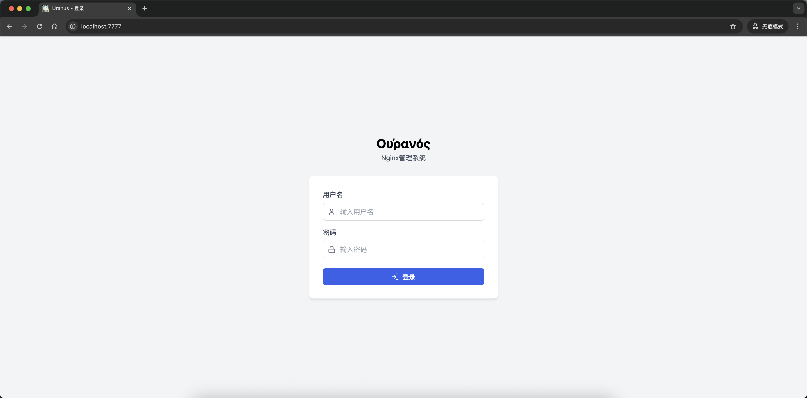
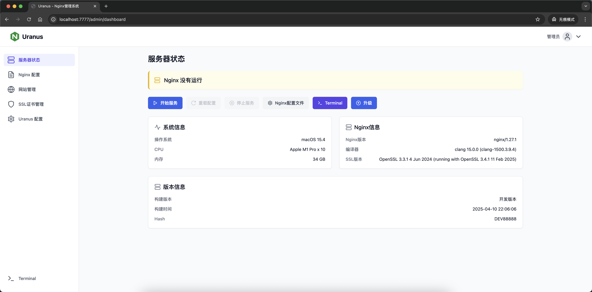
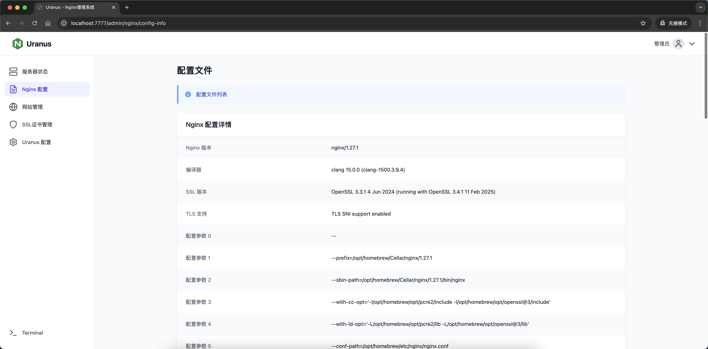
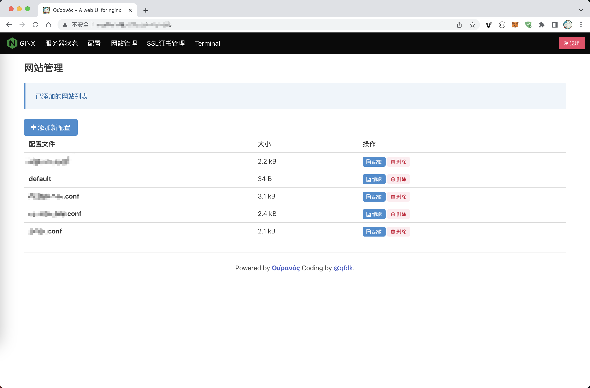
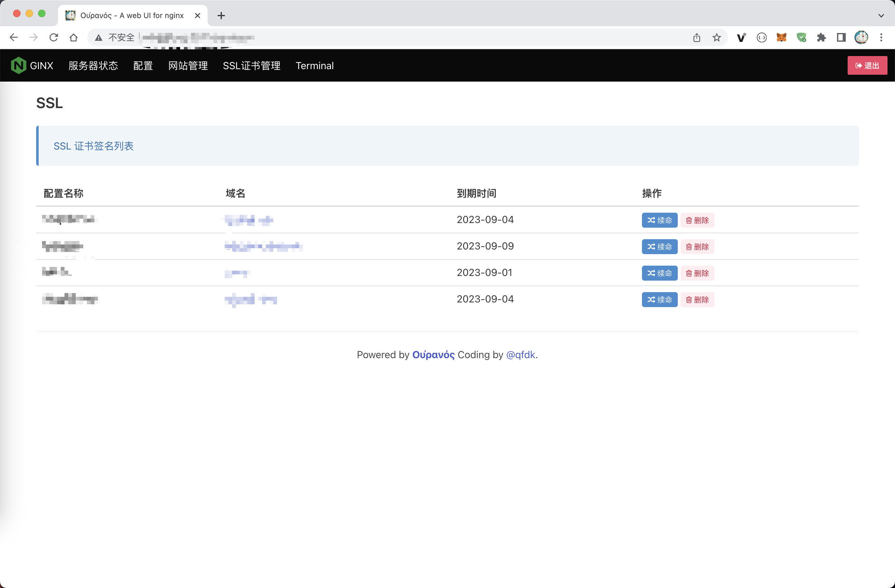
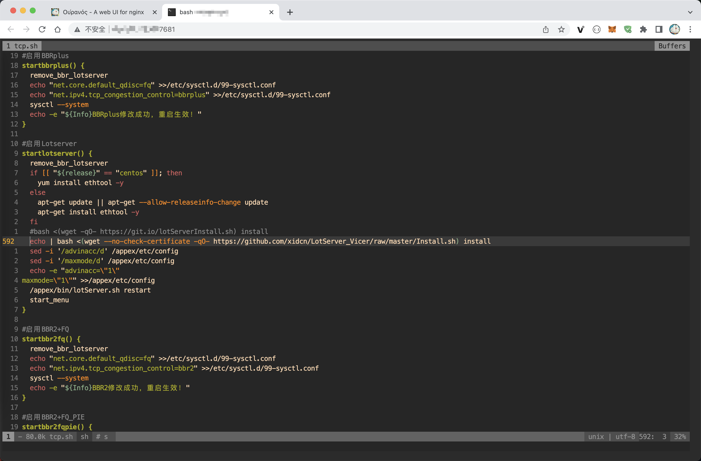
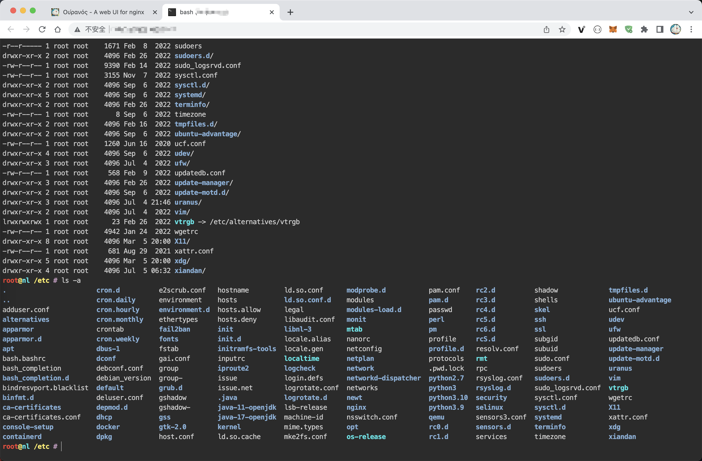

## Οὐρανός (拉丁语：Uranus)

Gin 框架写的 nginx 图形界面管理程序，可以 增、删、改、查 nginx的所有配置。
之前使用宝塔面板出现了很多未解之谜，比如为啥自动升级这样的问题，而且强制捆绑手机号。
本程序为了完全接管 nginx，然后方便自己进行管理操作。

**自用**，暂时不出文档, 任何问题与本人无关。

### 功能特性

* SSL 自动更新 : [Lego](https://github.com/go-acme/lego)
* 平滑更新支持 : [cloudflare/tableflip](https://github.com/cloudflare/tableflip)
* 数据库支持 : [gorm](https://github.com/go-gorm/gorm)
* SQLite : [SQLite](https://github.com/go-gorm/sqlite)
* Terminal : [ttyd](https://github.com/tsl0922/ttyd)
* VSCode : [vscode](https://github.com/microsoft/vscode)
* 一键升级

### 一键脚本

```bash
# 目前只测试过 ubuntu 20.04/22.04
wget -qO- https://fr.qfdk.me/uranus/install.sh|bash
# 升级脚本
wget -qO- https://fr.qfdk.me/uranus/upgrade.sh|bash
# 杀死进程
kill -9 $(ps aux|grep "uranus"|grep -v grep|awk '{print $2}')
```

### 截图预览








