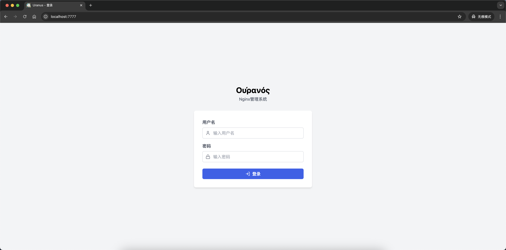
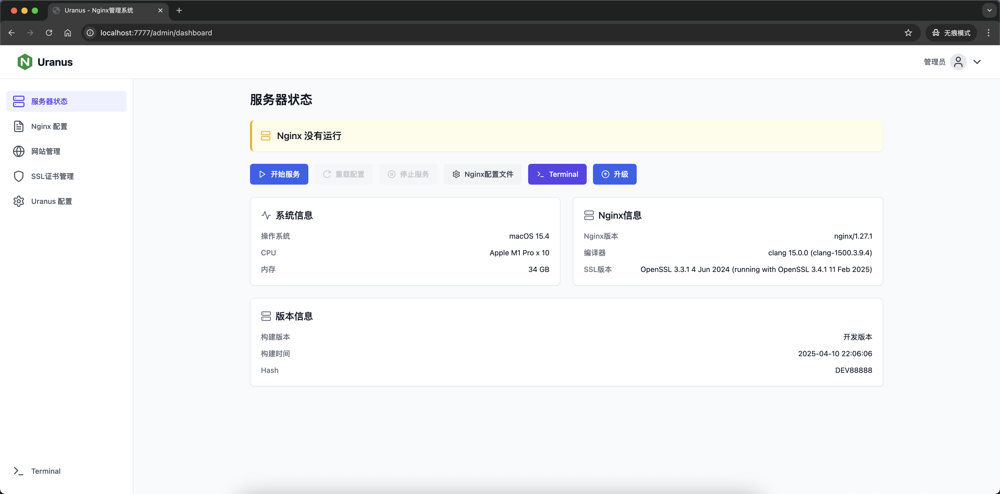
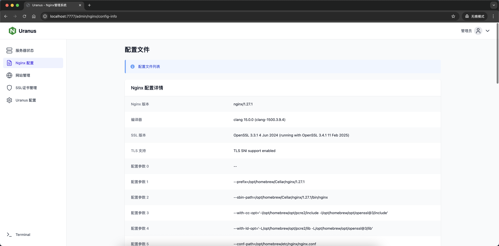
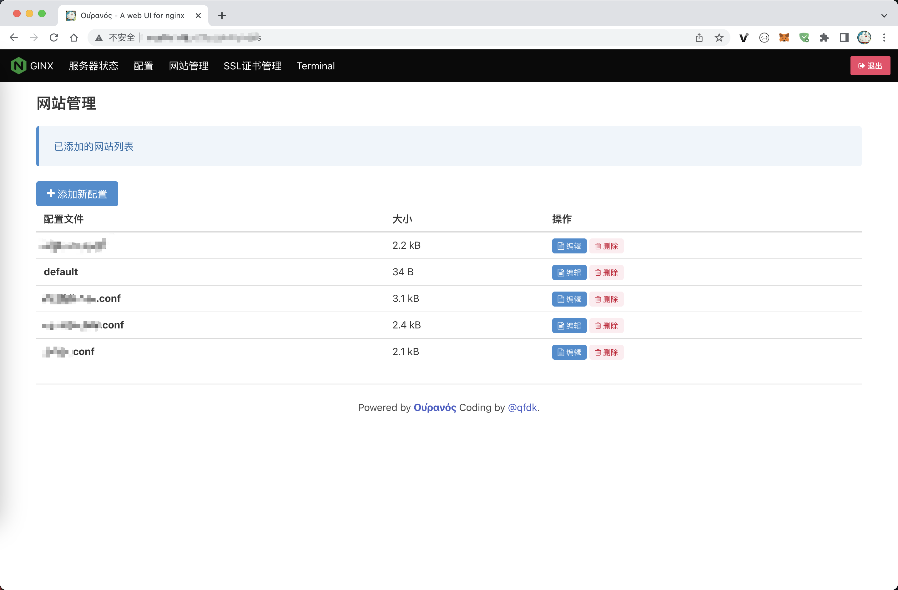
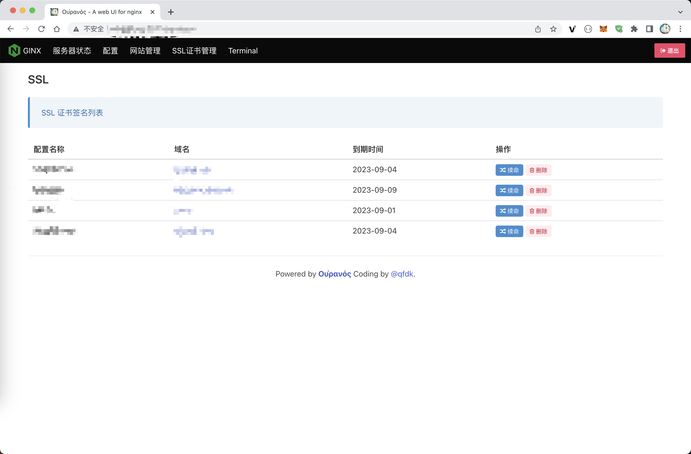
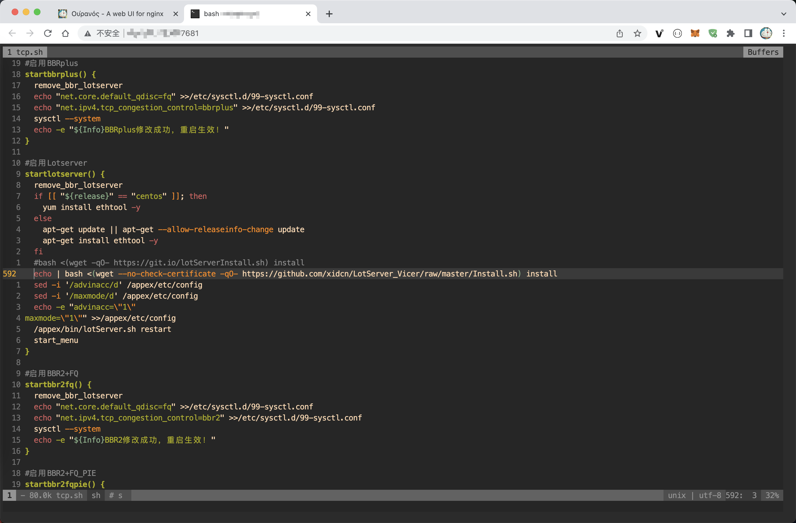
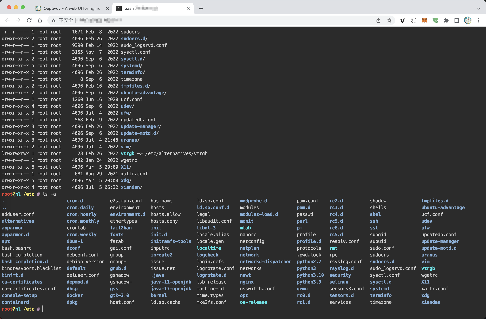

## Οὐρανός (拉丁语：Uranus)

Gin 框架写的 nginx 图形界面管理程序，可以 增、删、改、查 nginx的所有配置。
之前使用宝塔面板出现了很多未解之谜，比如为啥自动升级这样的问题，而且强制捆绑手机号。
本程序为了完全接管 nginx，然后方便自己进行管理操作。
还可以执行命令

**自用**，暂时不出文档, 任何问题与本人无关。

### ⚠️ 安全说明 / MQTT 远程管理

MQTT 远程管理（远程终端、配置下发、心跳上报）**默认关闭**，不会连接任何第三方服务器。

如需启用，请在 `config.toml` 中配置**你自己的** broker：

```toml
# 强烈建议使用 TLS（mqtts://）、broker 账号密码，并为每个 agent 配置 ACL
mqttBroker = "mqtts://your-mqtt-server:8883"
```

- 所有经 MQTT 下发的命令必须携带本 agent 的 `token`（见 `config.toml`），否则会被拒绝。
- 首次启动会生成随机管理员密码并打印在日志中，请登录后立即修改。
- 报告安全问题请见 [SECURITY.md](SECURITY.md)。

## 功能特性

* SSL 自动更新 : [Lego](https://github.com/go-acme/lego)
* 平滑更新支持 : [cloudflare/tableflip](https://github.com/cloudflare/tableflip)
* 数据库支持 : [gorm](https://github.com/go-gorm/gorm)
* SQLite : [SQLite](https://github.com/go-gorm/sqlite)
* Terminal : [ttyd](https://github.com/tsl0922/ttyd)
* VSCode : [vscode](https://github.com/microsoft/vscode)
* 一键升级

### 一键脚本

```bash
# 目前只测试过 ubuntu 20.04/22.04
wget -qO- https://fr.qfdk.me/uranus/install.sh|bash
# 升级脚本
wget -qO- https://fr.qfdk.me/uranus/upgrade.sh|bash
# 杀死进程
kill -9 $(ps aux|grep "uranus"|grep -v grep|awk '{print $2}')
```

### 截图预览









## 赞助

<a href="https://voilapro.app/?ref=github-uranus"></a>

本项目由 [Voilà Pro](https://voilapro.app/?ref=github-uranus) 赞助支持 —— macOS 语音输入工具。按住快捷键说话，文字直接落到光标处，中英法混说也能识别。
